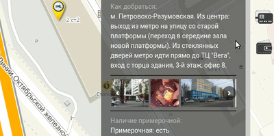

# slider

Slider component with preview on VueJS

## Project setup
```
yarn install
```

### Compiles and hot-reloads for development
```
yarn run serve
```

### Compiles and minifies for production
```
yarn run build
```

### Lints and fixes files
```
yarn run lint
```

### Options 

You can pass following options:

* height - Number, height in pixels
* margin - String, margin property
* maxWidth - Number, max-width property
* photo - Array of images located in `/src/assets` 

Example:

```javascript
<EntranceComponent 
        :photo="['logo.png', 'logo.png', 'logo.png', 'logo.png', 'logo.png', 'logo.png','logo.png', 'logo.png', 'logo.png']" 
        height="60" 
        maxWidth="200"
        marg="auto" />
```
### Demo 



